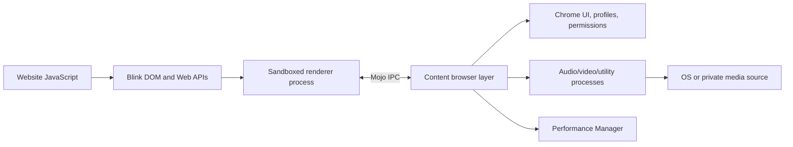
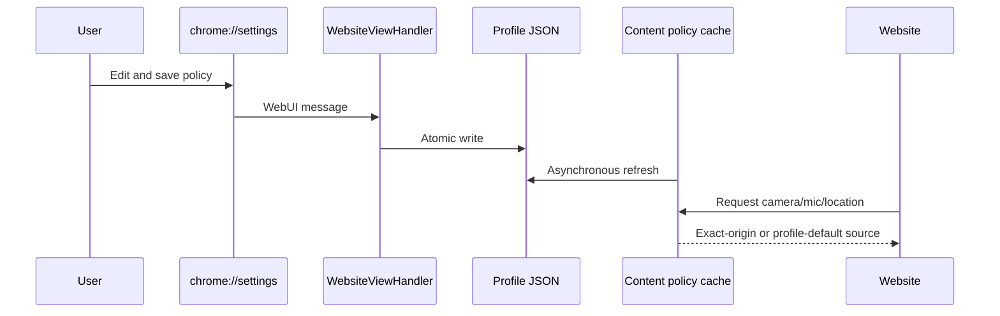
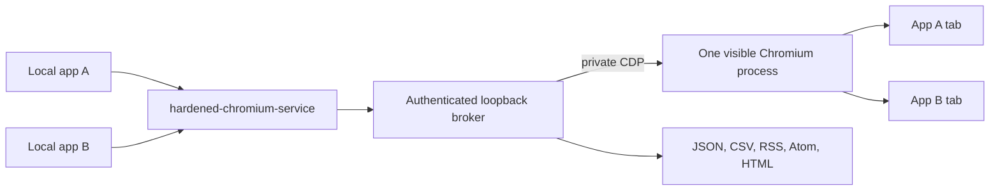

# Where a Website Meets Chromium

*Part 1 of the Hardened Chromium technical series*

[Series index](README.md#technical-article-series) ·
[Next: Website-visible state](ARTICLE_2_WEBSITE_VISIBLE_STATE.md)

Hardened Chromium is easier to understand once we stop treating “the browser”
as one program. A website runs inside a constrained renderer, while many of the
facts it asks for—device access, window state, process lifecycle, and profile
configuration—are decided elsewhere. Changing what a site observes therefore
requires choosing the right side of each process boundary.

This article builds that map. The remaining articles use it to explain exactly
where we changed behavior, what stock Chromium would normally expose, and what
the hardened build still cannot conceal.

## The short version

Chromium separates untrusted web execution from privileged browser services.
The renderer contains Blink and JavaScript execution. The browser process owns
tabs, profiles, permissions, and most policy. Dedicated utility, audio, video,
network, and GPU processes perform narrower jobs. Mojo interfaces carry typed
messages between those processes.

That separation is a security property, not an inconvenience to work around.
This fork keeps the renderer sandbox and changes policy at the narrowest layer
that already owns each decision.

Chromium's own [multi-process architecture
document](https://chromium.googlesource.com/playground/chromium-org-site/+/refs/heads/main/developers/design-documents/multi-process-architecture/index.md)
describes the browser/renderer split and the corresponding host objects. Blink's
[renderer overview](https://chromium.googlesource.com/chromium/src/+/main/third_party/blink/renderer/README.md)
then divides web-platform implementation into `core` and `modules`.

## The layers we changed

| Layer | What it normally owns | Hardened work in this layer |
| --- | --- | --- |
| Blink Core | Documents, focus, events, selection, input, windows, screens | Visibility and focus values, event suppression, user selection, native defaults, current-screen view |
| Blink Modules | Self-contained Web APIs | Private Async Clipboard behavior, idle changes, API exposure |
| Content | Browser-side embedding and renderer coordination | Page lifecycle, geolocation policy, media enumeration, command-line propagation |
| Chrome | Product UI and profile behavior | Permission source selectors, colored browser boundaries, Website View settings |
| Media and services | Physical and synthetic capture implementations | Combined real/private camera and microphone factories |
| Performance Manager | Freezing, discarding, resource policy | Foreground-style treatment and automatic-discard prevention |
| Local tools | Launch, automation, application integration | Profile launcher, authenticated broker, service ownership, feeds, diagnostics |

The fork modifies 163 files relative to Chromium revision
`f77d44b339946cd682d311c6c0bc922c32579fbd`. That count includes tests,
documentation, build registration, and branded assets—not 163 independent
behavior changes. The important pattern is that the same feature can require a
renderer hook, a browser-side policy hook, and a process-launch switch.

## Renderer-side facts

When JavaScript reads `document.hidden`, asks `document.hasFocus()`, handles a
`keydown`, calls `navigator.clipboard.readText()`, or inspects `screen`, it is
executing a Web API implemented by Blink. The relevant code is mostly under:

- `third_party/blink/renderer/core` for the DOM, editing, input, focus, and
  window model;
- `third_party/blink/renderer/modules` for APIs such as Clipboard and Idle
  Detection; and
- `third_party/blink/renderer/platform` for generated runtime-feature state.

Changing only JavaScript prototypes after page load would be shallow. A page
could keep an early reference, use a different realm, compare descriptors, or
reach another code path. This project instead changes the C++ implementation
that supplies the value or performs the default action. For example,
[`Document::hidden()`](third_party/blink/renderer/core/dom/document.cc) returns
the hardened value at the native getter, while
[`FocusController`](third_party/blink/renderer/core/page/focus_controller.cc)
changes the renderer's web-facing focus decisions.

Renderer hooks are not automatically enough. A renderer receives lifecycle
state from the browser process, and a camera request eventually leaves Blink.
Those flows also need browser-side changes.

## Browser-side authority

The `content` layer embeds Blink and mediates privileged operations. A
`WebContents` represents tab content in the browser process. Render view/frame
hosts coordinate with renderer-side objects. Device managers and permission
services decide which privileged resources a renderer may use.

That makes Content the appropriate place for several hardened decisions:

- [`WebContentsImpl`](content/browser/web_contents/web_contents_impl.cc) maps
  ordinary background tabs onto a visible renderer lifecycle state.
- [`PageLifecycleStateManager`](content/browser/renderer_host/page_lifecycle_state_manager.cc)
  blocks ordinary explicit freezing while preserving back-forward cache state.
- [`MediaDevicesManager`](content/browser/renderer_host/media/media_devices_manager.cc)
  filters camera and microphone enumeration after permission and removes model
  labels/group identifiers.
- [`hardened_privacy_source.cc`](content/browser/geolocation/hardened_privacy_source.cc)
  owns per-tab choices and the asynchronous exact-origin policy cache.

The browser process still knows reality. A background tab remains a background
tab to browser UI, accessibility, and ownership code; only the renderer-facing
lifecycle signal is substituted. This distinction avoids breaking unrelated UI
state merely to change a website-visible value.

## Chrome UI is a separate policy surface

Code under `chrome/` is product behavior layered on Content. This is where the
fork adds controls a user can see and operate:

- camera, microphone, and location source selection inside the normal
  permission experience;
- a red boundary for private named profiles and a blue boundary for the shared
  application-accessible profile; and
- a **Website view** editor inside `chrome://settings/privacy`.

The Website View editor uses a WebUI message handler rather than granting a web
page filesystem access. The TypeScript component sends a privileged WebUI
message; [`WebsiteViewHandler`](chrome/browser/ui/webui/settings/website_view_handler.cc)
reads or atomically writes `HardenedWebsiteView.json` beneath the active profile.
Ordinary websites cannot call that handler.

## Media crosses another boundary

Camera and microphone APIs begin in Blink, but capture devices are created by
browser and service code. The hardened camera factory composes two existing
ideas: the platform factory and Chromium's private/fake factory. It exposes a
private descriptor alongside system devices and unwraps the chosen descriptor
only when creating the underlying source.

[`HardenedVideoCaptureDeviceFactory`](media/capture/video/hardened_video_capture_device_factory.cc)
can route the private choice to deterministic fake video, a loop file, or a
named OBS virtual camera. Audio uses a dedicated private input identifier and
can keep the physical system microphone separate from fake media flags.

This is source virtualization, not permission bypass. The browser's ordinary
Allow/Block decision remains in front of capture. A granted request receives
the source selected by browser-owned policy.

## Runtime flags and process launch

Blink runtime-enabled features are generated controls used throughout the
renderer. Chromium explicitly supports downstream overrides in
[`runtime_enabled_features.override.json5`](third_party/blink/renderer/platform/runtime_enabled_features.override.json5),
as described by the upstream [runtime-feature documentation](https://chromium.googlesource.com/chromium/src/+/main/third_party/blink/renderer/platform/RuntimeEnabledFeatures.md).

This fork defines two important modes there:

- `HardenedPrivacyMode`, which gates the compatibility-breaking privacy and
  user-agency behavior; and
- `HardenedCurrentScreenOnly`, which narrows the web-visible display model
  independently.

The same override file removes a set of powerful or high-entropy APIs from the
default build. Command-line switches carry configuration that must be known at
process start. Content explicitly propagates relevant switches to renderers or
utility processes; otherwise adding a browser-process flag would not affect the
process that implements the API.

## A second architecture: applications around the browser

The project also has a local control plane outside Chromium. Applications do
not receive the private DevTools endpoint and do not launch competing browser
processes. They call a service command, which starts or discovers one visible
profile and an authenticated loopback broker. The broker creates tabs through
CDP and exposes task-oriented REST and event interfaces.

This is intentionally different from handing every application a debugging
port. The broker applies application identity, ownership, queue limits, replay,
recovery, and output policy before touching the browser.

## What “a website expects” means in this series

There are three different expectations, and mixing them produces misleading
claims:

1. **A standards contract.** Specifications define properties, events,
   permissions, and algorithms. Deliberately returning a different lifecycle
   value can be a compatibility break even when it serves the fork's goal.
2. **A Chromium implementation choice.** Timer throttling, process allocation,
   freezing, and automatic discarding include browser policy beyond the basic
   Web API contract.
3. **A site's inference.** A site can combine standards-visible values with
   timing, rendering, network, input, and device observations. No single
   property proves the real host state.

The next articles use “suppressed,” “redirected,” “filtered,” or “virtualized”
for the mechanism actually implemented. “Bypass” is reserved for the narrower
cases where a page cancels a user action and the hardened browser deliberately
performs its protected default anyway.

## How to read one change end to end

Consider a website calling `getUserMedia({video: true})`. The JavaScript method
and promise are Blink-facing API, but Blink cannot open `/dev/video*` directly
from its sandbox. The request crosses to Content, passes Permissions Policy and
Chrome's user permission UI, reaches media-device selection, and is finally
created by a capture factory in a service process. A complete source-selection
feature therefore needs more than a patched JavaScript result:

1. a browser-owned policy that resolves fake versus real for the requesting
   origin;
2. permission UI that exposes the choice without converting it into a grant;
3. enumeration that offers and ranks the private descriptor;
4. a capture factory that can route that descriptor to its backing source;
5. switch propagation to the process that constructs the factory; and
6. tests at policy, enumeration, UI, and factory boundaries.

The same reasoning explains why visibility work crosses layers. Blink owns the
getter and DOM event, Content sends lifecycle state, and Performance Manager
can freeze or discard a page independently. Patching only `document.hidden`
would leave timer pauses, lifecycle transitions, or reload-after-discard as
side channels.

This layered reading technique is useful when reviewing the fork:

- Start at the website-visible IDL/getter/event in Blink.
- Follow browser/renderer messages into Content when the answer requires
  privileged or tab-level state.
- Find Chrome UI only when a user or profile owns the decision.
- Continue into a service/factory when real hardware or OS integration is
  involved.
- Check launchers for values that must exist before child processes start.
- Finally, find a test at every boundary where the data changes shape.

It also exposes incomplete work. Website View can persist a `canvas` mode, for
example, but there is no corresponding canvas-rendering hook in the current
diff. Persistence plus UI is a configuration contract, not enforcement.

## Why the overlay contains whole files

The public repository intentionally carries every file added or changed by the
fork, while omitting hundreds of thousands of unchanged Chromium files and its
large upstream history. A builder checks out the pinned upstream revision and
restores the overlay paths on top.

This makes the public repository reviewable and small, but it changes how a
reader interprets it. A large file in the overlay is not necessarily entirely
new; often only a small native hook differs from upstream. The meaningful
review is the comparison against the documented base revision. Porting to a
newer Chromium release likewise means replaying and validating those semantic
hooks, not copying old files blindly over a new tree.

## Security boundary and verification

The renderer sandbox remains essential. The build guide explicitly compiles
and installs `chrome_sandbox`; `--no-sandbox` is not an acceptable workaround.
Network and host isolation remain operating-system responsibilities.

Tests are placed near each changed subsystem: Blink unit tests for native web
behavior, Content browser tests for lifecycle and screen state, Chrome tests
for UI boundaries and discard policy, and Python suites for broker/service
behavior. A complete release also requires a native `chrome` build because a
passing Python suite cannot validate C++ or TypeScript integration.

The detailed commands are in [BUILDING.md](docs/hardened_chromium/BUILDING.md)
and [VALIDATION.md](docs/hardened_chromium/VALIDATION.md).

## Limits to carry forward

This architecture can reduce or substitute specific signals. It cannot prove
that a site will view the browser as stock Chromium, nor can it make unrelated
fingerprint surfaces disappear. The changed binary is itself a distinct user
agent implementation. Always-visible documents and foreground-scheduled tabs
can also create unusual timing and resource patterns.

That is why the rest of this series pairs every mechanism with its residual
signals and compatibility cost.

---

[Next: Changing What a Website Can Observe →](ARTICLE_2_WEBSITE_VISIBLE_STATE.md)
