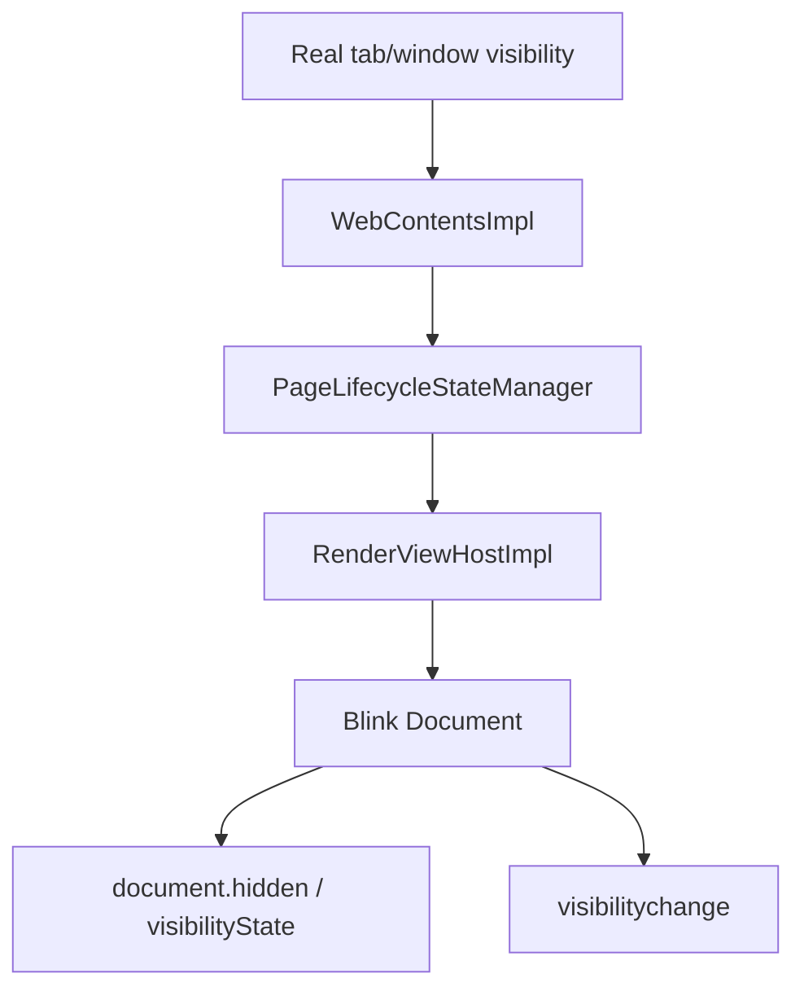
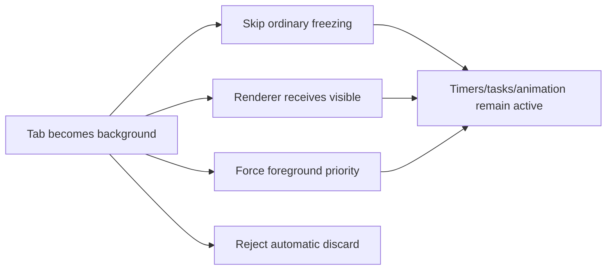
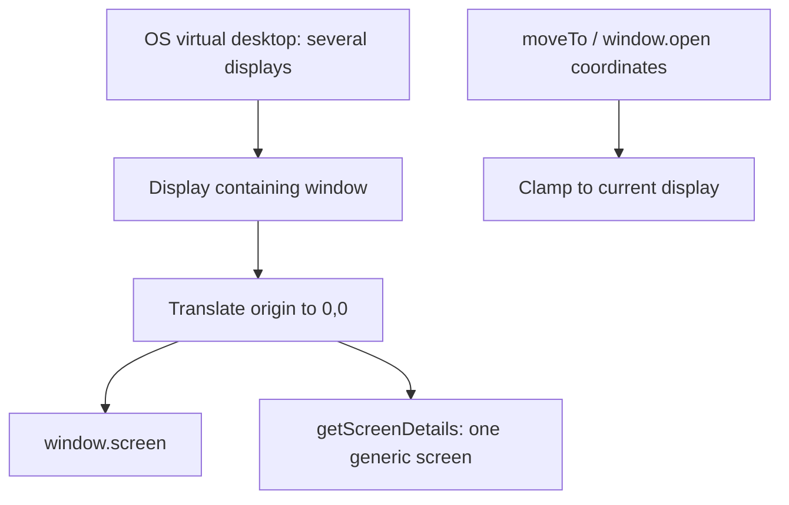

# Changing What a Website Can Observe

*Part 2 of the Hardened Chromium technical series*

[Previous: Chromium architecture](ARTICLE_1_CHROMIUM_ARCHITECTURE.md) ·
[Series index](README.md#technical-article-series) ·
[Next: User input and device privacy](ARTICLE_3_USER_INPUT_MEDIA_PRIVACY.md)

A page does not need a privileged exploit to learn that the user changed tabs,
moved focus, locked the session, attached multiple displays, or allowed a tab
to be frozen. The Web platform intentionally exposes many of these facts so
sites can save power, adapt UI, and build multi-screen applications.

Hardened Chromium deliberately changes that contract. It presents a stable,
foreground-oriented view to ordinary documents while leaving enough internal
truth intact for the browser to manage its own UI and security. This article
shows the split between the web-facing facade and Chromium's real state.

## What stock websites observe

The [HTML Standard's Page Visibility
section](https://html.spec.whatwg.org/multipage/interaction.html#page-visibility)
defines `document.hidden`, `document.visibilityState`, and
`visibilitychange`. A background tab normally becomes `hidden`; a site can
pause video, stop animation, defer analytics, or record the transition.

Focus is related but different. Under the [HTML focus
model](https://html.spec.whatwg.org/multipage/interaction.html#focus),
`document.hasFocus()` reports whether key events are being routed through the
document. Window and element `focus`/`blur` events expose changes in that route.

Chromium adds implementation policy beneath those APIs:

- background renderer priority can be reduced;
- animation frames and timers can take a slower path;
- a page can be frozen so its task queues stop running; and
- a tab can be discarded, destroying its renderer and reloading later.

Chromium's [freezing documentation](https://chromium.googlesource.com/chromium/src/+/HEAD/chrome/browser/performance_manager/docs/freezing_opt_out_opt_in.md)
describes freezing as preventing tasks in all frames from running. These
policies are valuable for normal power and memory management, but they also
create observable differences between foreground and background execution.

A typical site can combine several independent observations:

```js
const observations = {
  hidden: document.hidden,
  visibility: document.visibilityState,
  focused: document.hasFocus(),
  extendedScreen: screen.isExtended,
  screenOrigin: [screen.availLeft, screen.availTop],
};

document.addEventListener('visibilitychange', record);
window.addEventListener('focus', record);
window.addEventListener('blur', record);
```

Stock values serve legitimate UX and power-management purposes. The same
values can also become correlated state signals: a site can timestamp when the
user leaves, compare work completed by a background timer, and inspect whether
display geometry changed. The hardened implementation addresses the signals at
their native sources rather than trying to hide this sample script.

## The visibility hook is in Blink—and in Content

Returning a fixed value from the JavaScript getter is only half of the job.
Blink's `Document` reports state to the page, but Content supplies lifecycle
state to the renderer.



The hardened path changes each web-relevant stage:

| Hook | Change |
| --- | --- |
| [`WebContentsImpl::CalculatePageVisibilityState`](content/browser/web_contents/web_contents_impl.cc) | Maps ordinary background content to `kVisible` for the renderer |
| [`RenderViewHostImpl`](content/browser/renderer_host/render_view_host_impl.cc) | Avoids initializing a non-prerendered hardened page as hidden |
| [`Document::hidden`](third_party/blink/renderer/core/dom/document.cc) | Returns `false` while the document remains attached |
| `Document::DidChangeVisibilityState` | Suppresses standard and legacy visibility events in hardened mode |
| `Document::DispatchUnloadEvents` | Avoids manufacturing a final hardened visibility transition during unload |

`document.visibilityState` is derived from the same Blink visibility model, so
it remains `visible`. The page is not merely denied an event; a later property
read returns the same facade.

The implementation still uses the real internal visibility for operations
that should not be lied to. Font-cache pruning and Blink's interactive detector
consult `IsPageVisible()` rather than the hardened `hidden()` getter. Browser
UI and accessibility continue to know which tab is selected.

### What this bypasses—and what it does not

It bypasses a site's direct reliance on Page Visibility transitions as a test
for whether the user selected another tab or obscured the window. It does not
guarantee foreground-equivalent timing by itself, nor hide process pauses
caused by the OS, CPU contention, suspension, or a crash.

## Focus without activation signals

Blink's [`FocusController`](third_party/blink/renderer/core/page/focus_controller.cc)
normally tracks whether a page is active and focused, then dispatches events to
the window and focused element. Hardened mode changes its web-facing predicates
so `IsActive()` and `IsFocused()` stay true. The dispatch helper returns before
sending focus/blur transitions caused by page activation changes.

[`Document::hasFocus()`](third_party/blink/renderer/core/dom/document.cc) then
returns true as long as the document still has a `Page`.

This does not force keyboard input into a background tab. The operating system
and browser still route actual input to the active surface. It only removes the
direct DOM report that routing changed. A site can still infer an input gap or
observe that expected user activity stopped.

## Keeping background pages on the active path

The fork uses several hooks because visibility, scheduling, freezing, and
discarding are different mechanisms.



- `IsForceForegroundPriorityForAllTabsEnabled()` returns true while the base
  hardened feature is enabled.
- `Freezer::MaybeFreezePageNode()` exits without freezing hardened pages.
- `PageLifecycleStateManager::SetIsFrozen()` rejects ordinary explicit-freeze
  state and calculates a non-frozen lifecycle value.
- `DiscardEligibilityPolicy` rejects non-external discard reasons.

The boundaries are intentional:

- **Back-forward cache remains functional.** BFCache freezing is represented by
  `is_in_back_forward_cache`, not the blocked ordinary-freeze path.
- **User or extension discards remain possible.** The discard policy permits
  `DiscardReason::EXTERNAL` rather than trapping the user in an undiscardable
  tab.
- **Prerendering remains distinct.** Initial visibility substitution excludes
  prerendered pages.

The cost is straightforward: tabs that would normally consume little CPU or
memory may keep running at foreground priority. Battery life, thermal behavior,
and contention can worsen. Ironically, unusually steady background timing can
itself distinguish this build from stock Chromium.

## Stable active/unlocked idle state

Idle Detection exposes whether the user is idle and whether the screen is
locked after permission has been granted. Hardened Chromium preserves the API
shape and its initial notification, but
[`IdleDetector::Update`](third_party/blink/renderer/modules/idle/idle_detector.cc)
sets the web-facing state to active/unlocked and ignores later OS transitions.
Its idle timer also refuses to flip the state.

This is a facade, not simulated activity. It does not move the mouse, type
keys, prevent the host from locking, or keep the machine awake.

## Current-screen-only geometry

The [Window Management specification](https://w3c.github.io/window-management/)
defines APIs for discovering screens, their virtual arrangement, labels, and
whether the desktop is extended. Those values can reveal a multi-monitor
layout and can change when the window moves.

`HardenedCurrentScreenOnly` narrows that model:

- `screen.isExtended` is fixed to false;
- detailed screen lists contain only the current screen;
- the current screen is presented as primary with a generic label;
- `left`, `top`, `availLeft`, and `availTop` become relative to the current
  screen rather than the OS virtual-desktop origin;
- `screenX` and `screenY` use the same local coordinate space;
- screen-change comparisons ignore hidden topology fields; and
- `window.moveTo`, `moveBy`, and positioned `window.open` requests are clamped
  to the current display.

The core hooks live in
[`Screen`](third_party/blink/renderer/core/frame/screen.cc),
[`ScreenDetails`](third_party/blink/renderer/modules/screen_details/screen_details.cc),
[`ScreenDetailed`](third_party/blink/renderer/modules/screen_details/screen_detailed.cc),
and [`LocalDOMWindow`](third_party/blink/renderer/core/frame/local_dom_window.cc).



The browser does not invent a standard monitor size. Width, height, available
area, depth, scaling, and current-display changes can still be visible. A site
may infer display characteristics from rendering or window constraints even
without the full topology.

## Virtual fullscreen

Fullscreen normally crosses from Blink to the browser and operating system,
resizing or moving the native window. That transition exposes screen geometry
and affects surrounding UI.

In hardened mode,
[`FullscreenController`](third_party/blink/renderer/core/frame/fullscreen_controller.cc)
completes the DOM-side enter/exit state locally. The requesting page sees
`document.fullscreenElement`, `:fullscreen` styling, resolved promises, and
`fullscreenchange`, but the browser window does not enter OS fullscreen.

This is a deliberate compatibility substitution. A video or game can believe
its element entered fullscreen while the physical window remains unchanged.
The page can still compare viewport dimensions and discover that the expected
native resize did not happen.

## Removing powerful surfaces

The downstream runtime-feature override disables APIs whose capability or
device exposure conflicts with this profile:

- Compute Pressure
- Contacts
- EyeDropper
- File System Access
- Payment Request
- Presentation and Remote Playback
- Serial
- Wake Lock
- Bluetooth, HID, NFC, Web Share, USB, and WebXR

The hook is centralized in
[`runtime_enabled_features.override.json5`](third_party/blink/renderer/platform/runtime_enabled_features.override.json5),
the extension point Chromium documents for downstream forks. This removes or
disables the relevant API surface instead of returning fabricated device data.

Screen capture is intentionally not in that list. `getDisplayMedia()` keeps the
browser-owned picker, so the user selects a tab, window, or monitor and can stop
sharing through browser UI.

Feature absence is itself observable. A site can test whether a constructor or
method exists, so reducing capability exposure is not the same as blending into
stock Chromium.

## Cursor boundary events

At the browser/view boundary,
[`RenderWidgetHostViewEventHandler`](content/browser/renderer_host/render_widget_host_view_event_handler.cc)
converts an outer-surface mouse exit into a clamped final move, suppresses the
matching re-entry, and refuses to forward `MouseExited` to the renderer. Blink's
[`EventHandler`](third_party/blink/renderer/core/input/event_handler.cc) also
guards the outermost main frame's leave path.

Boundary events inside the document and across frames remain normal. The
specific signal removed is the cursor crossing from web content into browser
chrome or outside the window.

## Verification map

The changes are covered at the layers where regressions would appear:

- document/style/focus/input behavior in Blink unit and web-view tests;
- lifecycle calculations and BFCache distinctions in Content browser tests;
- automatic discard and freezing behavior in Performance Manager tests;
- screen topology, movement, and change behavior in screen browser tests; and
- the integrated native `chrome` build for generated runtime flags and
  cross-process linkage.

The manual test page at
[`tools/hardened_chromium/hardened_mode_test.html`](tools/hardened_chromium/hardened_mode_test.html)
shows the values visible to JavaScript, but a manual page is evidence for a
scenario—not a proof that all possible inference paths are gone.

## Detection and compatibility limits

The facade is intentionally inconsistent with standards in several places. A
hidden page that reports visible, a virtual fullscreen that does not resize the
viewport as expected, or an absent set of normally available APIs can all be
recognized by sufficiently motivated code.

Other residual signals include:

- timer, rendering, and network jitter;
- compositor behavior and animation cadence;
- input inactivity while focus remains reported;
- window and viewport constraints;
- OS suspension and process scheduling outside Chromium's control; and
- unrelated fingerprint surfaces not hooked by this project.

The goal is to remove direct, high-confidence state disclosures and keep
background work alive—not to promise non-detectability.

The resulting behavior can be summarized as follows:

| Real event | Stock page observation | Hardened page observation |
| --- | --- | --- |
| User selects another tab | Hidden state and `visibilitychange` | Visible state; no visibility event |
| Browser window loses focus | `hasFocus()` false and focus/blur transitions | `hasFocus()` true; activation transition suppressed |
| Page becomes freeze-eligible | Tasks may stop | Ordinary freezing skipped |
| Memory policy chooses a tab | Tab may be automatically discarded | Non-external discard rejected |
| Window moves to another display | Global coordinates/topology may change | Coordinates normalized to current display |
| Page requests fullscreen | Native window transition plus DOM state | DOM fullscreen state without native transition |
| OS reports idle/locked | Idle Detector can change | Stable active/unlocked facade |

That table is intentionally about direct API behavior. It says nothing about
what a classifier can infer from secondary effects, which is why timing and
resource caveats remain part of the acceptance criteria.

---

[← Previous: Where a Website Meets Chromium](ARTICLE_1_CHROMIUM_ARCHITECTURE.md)
· [Next: Protecting User Actions and Physical Devices →](ARTICLE_3_USER_INPUT_MEDIA_PRIVACY.md)
