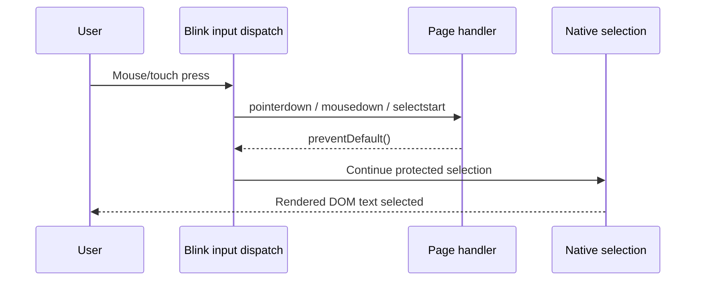
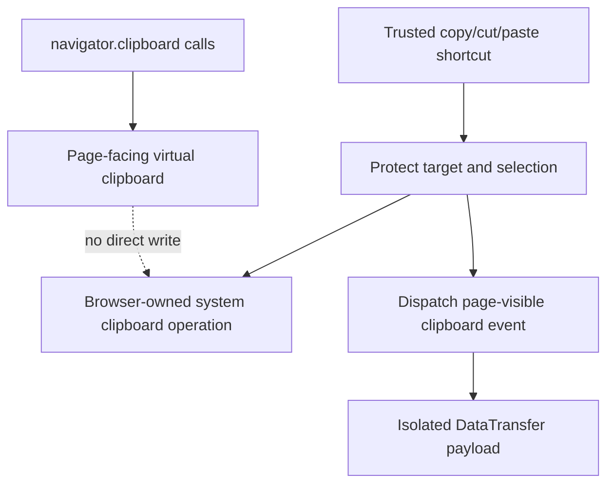
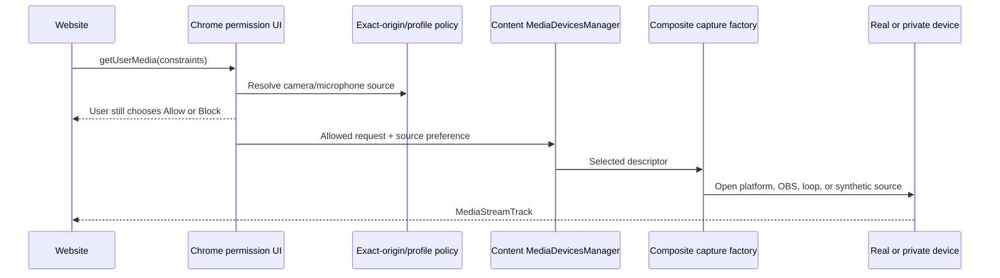

# Protecting User Actions and Physical Devices

*Part 3 of the Hardened Chromium technical series*

[Previous: Website-visible state](ARTICLE_2_WEBSITE_VISIBLE_STATE.md) ·
[Series index](README.md#technical-article-series) ·
[Next: Website View and automation](ARTICLE_4_AUTOMATION_POLICY_BROKER.md)

Web content normally participates in user actions. It can cancel a context
menu, prevent a selection from starting, change a drag payload, intercept a
copy shortcut, and—after permission—receive camera, microphone, or location
data. Those capabilities enable rich applications, but they also let a hostile
page obstruct the user or turn physical-device details into persistent signals.

Hardened Chromium separates two questions:

1. What event and result should the page observe?
2. What browser-owned action or source should the user actually receive?

For selected trusted actions, the page still receives its event and can appear
to cancel or modify it, while the browser preserves an independent native
default. For physical devices, permission remains mandatory, but the browser
can route an allowed request to a private source.

## The stock event contract

DOM UI events have dispatch phases, cancelability, and default actions. The
[UI Events specification](https://w3c.github.io/uievents/) describes actions
such as starting selection, scrolling, and drag-and-drop; calling
`preventDefault()` on a cancelable event normally asks the user agent not to
perform the associated default.

Clipboard behavior has another layer. The [Clipboard API and Events
specification](https://w3c.github.io/clipboard-apis/) integrates `copy`, `cut`,
and `paste` events with the system clipboard and defines asynchronous methods
such as `readText()` and `writeText()`. Page handlers can alter event payloads
within the permissions and user-activation rules enforced by the browser.

That means a page can deliberately:

- set `user-select: none` or make content inert;
- cancel `pointerdown`, `mousedown`, or `selectstart`;
- cancel `contextmenu` to replace the native menu;
- cancel keyboard defaults such as selection or scrolling;
- mutate a native drag payload in `dragstart`; or
- write a replacement value during a copy event.

Hardened mode narrows that control for trusted user input. Script-generated
events do not receive the same privilege.

## Selection is enforced below CSS and events

Protecting selection requires more than overriding one CSS property. Blink can
reject selection because of computed style, inertness, a canceled pointer
event, or a canceled `selectstart` event.

The fork hooks all of those decision points:

| Hook | Hardened behavior |
| --- | --- |
| [`ComputedStyle::UsedUserSelect`](third_party/blink/renderer/core/style/computed_style.h) | Treats content as selectable text; preserves the more permissive `user-select: all` |
| `ComputedStyle::IsSelectable` | Returns true even for inert or author-disabled content |
| [`FrameSelection`](third_party/blink/renderer/core/editing/frame_selection.cc) | Dispatches `selectstart` but ignores its cancellation for the native selection path |
| [`SelectionController`](third_party/blink/renderer/core/editing/selection_controller.cc) | Applies the same rule to mouse/touch selection and permits touch multi-click selection |
| [`EventHandler`](third_party/blink/renderer/core/input/event_handler.cc) | Runs selection handling after a trusted left press even when the page handled the press |
| [`GestureManager`](third_party/blink/renderer/core/input/gesture_manager.cc) | Keeps touch selection from being suppressed by canceled synthesized pointer/mouse events |

The page-visible event remains canceled. The bypass is narrowly in the
browser's decision to continue the user-requested selection.

This applies to rendered DOM text. It is not OCR. Text painted into a canvas,
image, video frame, WebGL surface, or plugin remains pixels unless another
feature exposes its underlying data.

## Context menus and native keyboard defaults

At the common event post-processing point,
[`EventDispatcher`](third_party/blink/renderer/core/dom/events/event_dispatcher.cc)
allows the trusted `contextmenu` default handler to run even if page code called
`preventDefault()`. Mouse, touch, and keyboard requests can therefore open the
Chromium menu. The page event still fires, so a site's custom HTML menu may
appear as well.

[`KeyboardEventManager`](third_party/blink/renderer/core/input/keyboard_event_manager.cc)
protects a small set of native commands:

- Copy, cut, paste, and paste-with-style are recognized before page keyboard
  handlers can replace the selection or target used by the real operation.
- Select All runs after page dispatch, leaving the requested final selection
  even if the key event was canceled.
- Navigation/scroll keys can run the browser default after cancellation on
  non-editable content.

Editable controls and elements with textbox semantics retain ordinary key
handling, preventing hardened scrolling logic from corrupting text input or
script-defined widgets.

## Clipboard: one real action and one page-facing facade

The clipboard design separates a trusted user-agent operation from script's
view of clipboard data.

The relevant hooks are split intentionally:

- [`ClipboardCommands`](third_party/blink/renderer/core/editing/commands/clipboard_commands.cc)
  handles editor commands and dispatches isolated clipboard events.
- [`KeyboardEventManager`](third_party/blink/renderer/core/input/keyboard_event_manager.cc)
  orders the trusted native action around page keyboard dispatch.
- [`Clipboard`](third_party/blink/renderer/modules/clipboard/clipboard.cc)
  implements a private buffer for `navigator.clipboard` reads and writes.

In hardened mode, a script-initiated `execCommand("copy")` or
`execCommand("cut")` can receive a successful, writable event payload without
being allowed to replace the user's system clipboard. `navigator.clipboard`
remains present on secure pages, but its reads and writes resolve against the
page-facing buffer. Clipboard-change observation is not wired to OS changes.

For a trusted shortcut, the real selection is protected before page keyboard
handlers run. The page can cancel or mutate its isolated event and observe that
behavior, but it does not replace the browser-owned system operation.

This is deliberately not stock Clipboard behavior. It can break collaborative
editors, password managers implemented as web apps, and sites that genuinely
need to exchange clipboard data with native applications. The existence and
lifetime of the virtual buffer may also be distinguishable.

## Native drag data survives page handlers

For a native link, image, or selection drag,
[`MouseEventManager`](third_party/blink/renderer/core/input/mouse_event_manager.cc)
snapshots the browser-generated `WebDragData` and allowed operations before
dispatching `dragstart`. The page can still handle, mutate, or cancel its event;
the native path restores the protected payload before entering the system drag
loop.

Author-created DHTML drag sources are excluded. Their data belongs to the web
application, so normal script control is preserved.

## What sites expect from media devices

The [Media Capture and Streams specification](https://w3c.github.io/mediacapture-main/getusermedia.html)
defines `getUserMedia()`, media constraints, tracks, and device enumeration.
It also recognizes device lists, identifiers, labels, groups, and capabilities
as fingerprinting surfaces. After permission or active capture, a site can
normally learn much more about attached hardware.

Hardened Chromium keeps the permission decision but changes source selection
and post-permission exposure.

### Camera factory composition

[`HardenedVideoCaptureDeviceFactory`](media/capture/video/hardened_video_capture_device_factory.cc)
wraps the platform and private factories. Enumeration obtains both lists,
prefixes private identifiers so routing remains unambiguous, and orders the
configured default first. Creation removes that wrapper identifier and invokes
the correct underlying factory.

The private camera can be:

- Chromium's deterministic synthetic capture;
- a Y4M loop file; or
- a named platform device such as OBS Virtual Camera, relabeled as private.

The OBS path is still a platform capture device. The wrapper recognizes the
configured display name, removes it from the ordinary platform list, and
reintroduces it through the private descriptor so source policy treats it as
the private choice.

### Microphone separation

Audio enumeration adds a dedicated private microphone identifier. A separate
switch permits fake video while retaining the system microphone when explicitly
requested; stock fake-media flags otherwise tend to affect both kinds.

### Enumeration after permission

[`MediaDevicesManager`](content/browser/renderer_host/media/media_devices_manager.cc)
filters authorized camera and microphone results to the chosen class—real or
private—and returns at most one input of each kind. It replaces labels with
`Camera` and `Microphone` and clears group identifiers, avoiding direct model
and paired-device disclosure.

This does not normalize every track capability. Resolution, frame rate, audio
properties, performance, and the media content itself can still reveal what
kind of source is producing the stream.

## Permission UI and source policy

Chrome's normal permission flow remains the authority to Allow or Block.
Hardened additions let that browser-owned UI select **Private** or **Real** for
camera, microphone, and location. A source choice does not grant permission.

The source precedence is:

1. an explicit choice made for the current request/tab;
2. an exact HTTP(S)-origin rule from the profile Website View document; and
3. the profile-wide default, which is fake for a fresh profile.

Exact origin means scheme, host, and effective port. A rule for
`https://example.test` does not cover `https://sub.example.test`, a non-default
port, or an embedded third-party origin.

### A complete camera request

Suppose `https://example.test` requests video. Chrome first applies secure-
context and Permissions Policy checks, then presents its ordinary permission
decision. The hardened preview can show the source choice, but selecting
**Private** is not equivalent to clicking **Allow**.

After an allow decision, source resolution checks current request state and the
exact-origin Website View rule before falling back to the profile default.
Media enumeration contains both platform and private descriptors internally,
but the page-facing result is filtered to the selected class. The chosen
descriptor is routed by the composite factory to a physical camera, OBS, loop
file, or synthetic implementation. Once exposed to the page, the input label
is generic and its group ID is cleared.

This sequencing prevents two dangerous shortcuts. The policy does not bypass
permission, and it does not merely rename a physical camera while continuing
to expose the full device inventory. It still cannot make two fundamentally
different video sources produce identical frames, capabilities, or timing.

## Location without blocking browser threads

The [Geolocation specification](https://w3c.github.io/geolocation/) treats
location as a permission-controlled capability. In stock Chromium, an allowed
request can reach the platform location provider.

[`hardened_privacy_source.cc`](content/browser/geolocation/hardened_privacy_source.cc)
adds per-`WebContents` source state and a process-wide rules cache. File I/O
runs away from the browser's critical thread. Callers use an immutable snapshot
that refreshes on a short interval.

The cache fails private during a file transition: if the configured rules path
changes and the matching snapshot is not ready, the lookup returns the fake
choice rather than accidentally consulting stale rules from another profile.
An exact-origin entry wins over the profile default.

[`GeolocationServiceImpl`](content/browser/geolocation/geolocation_service_impl.cc)
then routes an allowed request to the configured fake coordinates or the real
provider. Permission and source selection remain separate decisions.

## Display capture stays user-mediated

Camera virtualization does not silently substitute desktop capture. The fork
keeps `getDisplayMedia()` and Chromium's browser-owned picker. A user selects
the shared tab, window, or monitor and can stop capture through browser UI, in
line with the user-choice model of the [Screen Capture
specification](https://w3c.github.io/mediacapture-screen-share/).

## Verification and limitations

The project tests selection across CSS, inertness, mouse/touch cancellation,
and `selectstart`; clipboard separation and command behavior; context-menu and
input defaults; media enumeration and factory routing; source selectors; and
location policy. The manual hardened-mode page requests camera, microphone,
both independently, and location while reporting the values visible to script.

Important limits remain:

- virtual sources are not indistinguishable from physical devices;
- media contents and capabilities remain analyzable;
- a site may recognize generic labels or a one-device inventory;
- permissions, secure-context requirements, and OS failures still apply;
- the virtual clipboard intentionally breaks some legitimate integrations; and
- protected selection covers DOM text, not pixels.

The implementation protects particular user actions and reduces direct device
exposure. It does not establish a universal anti-fingerprinting identity.

---

[← Previous: Changing What a Website Can Observe](ARTICLE_2_WEBSITE_VISIBLE_STATE.md)
· [Next: Website View, Automation Signals, and the Shared Browser →](ARTICLE_4_AUTOMATION_POLICY_BROKER.md)
