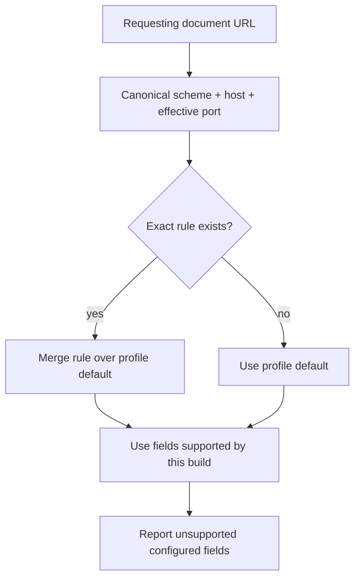
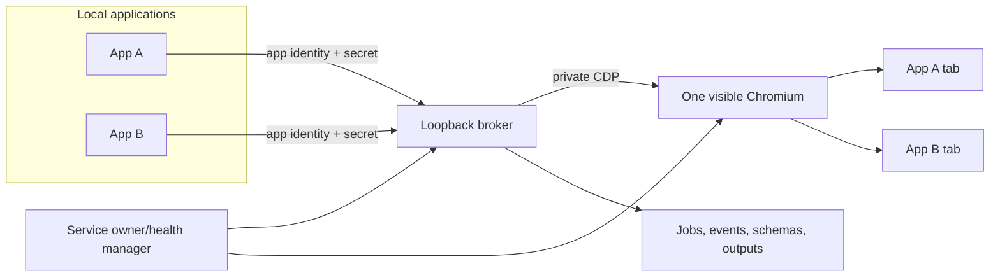

# Website View, Automation Signals, and the Shared Browser

*Part 4 of the Hardened Chromium technical series*

[Previous: User input and device privacy](ARTICLE_3_USER_INPUT_MEDIA_PRIVACY.md) ·
[Series index](README.md#technical-article-series)

The final part of the system lives both inside and outside Chromium. A
profile-owned Website View document describes what selected sites should see.
Launchers translate startup-sensitive fields into command-line switches.
Browser and renderer hooks enforce the subset that exists today. A separate
authenticated broker gives local applications task-oriented access to one
visible browser without publishing its DevTools endpoint.

This architecture reduces several direct automation and device signals, but it
does not turn automation into an undetectable activity. The distinction between
configured, enforced, and merely aspirational fields is central to the design.

## The WebDriver expectation

The [WebDriver specification](https://w3c.github.io/webdriver/) defines a
webdriver-active flag and exposes it through `navigator.webdriver`. Standards-
conforming automation uses that signal so content can know that the user agent
is under remote control.

Chromium also changes renderer feature state for some debugging launch modes.
In this fork, launching with remote debugging port zero was associated with the
`AutomationControlled` path. The service and launchers therefore use a fixed,
non-zero loopback port—`9222` by default—and refuse zero.

That reduces two direct signals:

1. the port-zero launch path is avoided; and
2. a renderer switch can make the native `Navigator::webdriver()` getter
   return false.

It does not erase all side effects of DevTools Protocol control.

## The switch crosses a process boundary

`navigator.webdriver` is implemented in Blink, inside a renderer process. The
launcher starts the browser process. A browser-only flag would therefore be
insufficient unless Content forwards it when starting renderers.

```mermaid
sequenceDiagram
  participant L as Launcher/service
  participant B as Browser process
  participant RPH as RenderProcessHostImpl
  participant R as Renderer process
  participant N as Blink Navigator
  L->>B: --hardened-webdriver-mode=hide|report
  B->>RPH: Build renderer command line
  RPH->>R: Propagate hardened switch
  N->>R: Read current-process command line
  R-->>N: false for hide; Chromium result for report
```

The implementation points are:

- [`run_for_automation.sh`](tools/hardened_chromium/run_for_automation.sh) and
  [`run_headless_for_automation.sh`](tools/hardened_chromium/run_headless_for_automation.sh)
  validate a non-zero loopback port and choose the automation mode;
- [`RenderProcessHostImpl`](content/browser/renderer_host/render_process_host_impl.cc)
  includes the switch in browser-to-renderer propagation; and
- [`Navigator::webdriver`](third_party/blink/renderer/core/frame/navigator.cc)
  returns false for `hide`, while `report` retains Chromium's normal result.

The value is startup-sensitive so a document does not change identity midway
through its lifetime. Changing it requires restarting Chromium.

Calling this an “automation bypass” needs qualification. It bypasses a check
that treats `navigator.webdriver === true` as sufficient evidence. It does not
bypass checks based on timing, DOM/CDP side effects, input patterns, extension
state, rendering, networking, browser-build differences, or combinations of
those observations.

## Website View is a profile document

Each automation or named profile can own a file called
`HardenedWebsiteView.json`. The default document has schema version 3, one
profile baseline, and a list of exact-origin rules.

A simplified example looks like this:

```json
{
  "schemaVersion": 3,
  "default": {
    "cameraSource": "fake",
    "microphoneSource": "fake",
    "locationSource": "fake",
    "persona": {},
    "exposures": {
      "automation": "hide"
    }
  },
  "rules": [
    {
      "origin": "https://example.test",
      "cameraSource": "real"
    }
  ]
}
```

The actual default contains named persona and exposure fields. The important
contract is structural:

- `default` supplies the profile baseline;
- `rules` override selected values for exact HTTP(S) origins;
- unknown expert fields are retained rather than silently discarded; and
- schema normalization never invents a different persona to make invalid input
  look successful.

[`hardened_website_view.py`](tools/hardened_chromium/hardened_website_view.py)
normalizes documents, canonicalizes origins, resolves policy, preserves future
fields, writes atomically, and produces warnings. Origin validation rejects
paths, credentials, non-HTTP schemes, invalid ports, queries, and fragments.

## Exact-origin resolution

Policy is resolved for the origin that owns the web request, not by suffix or
substring matching.



Thus `https://example.test` does not match `http://example.test`,
`https://sub.example.test`, or `https://example.test:8443`. An embedded third-
party frame uses its own origin. This prevents a convenient-looking site rule
from becoming an unexpectedly broad trust rule.

## Settings UI without web filesystem access

The editor is embedded under `chrome://settings/privacy`. It intentionally
shows the raw JSON document so an expert can edit the full stable contract.

The page component
[`website_view.ts`](chrome/browser/resources/settings/privacy_page/website_view.ts)
uses `sendWithPromise` to call `getHardenedWebsiteView` and
`setHardenedWebsiteView`. The browser-side
[`WebsiteViewHandler`](chrome/browser/ui/webui/settings/website_view_handler.cc)
resolves those WebUI messages, validates the minimum document shape, forces the
current schema version, and atomically writes inside the active profile.

This interface is privileged Chrome WebUI, not an HTTP endpoint available to
arbitrary sites. A normal page cannot use it to read another profile's policy
file.

## What Website View enforces today

The document deliberately describes a larger future contract than the current
native hooks. The broker reports warnings rather than pretending unsupported
fields work.

| Policy area | Current state | Enforcement point |
| --- | --- | --- |
| Default camera source | Enforced | Media permission/device selection |
| Exact-origin camera source | Enforced | Content source lookup and media enumeration |
| Default microphone source | Enforced | Media permission/device selection |
| Exact-origin microphone source | Enforced | Content source lookup and media enumeration |
| Default location source | Enforced | Geolocation service routing |
| Exact-origin location source | Enforced | Content source lookup |
| `exposures.automation` | Enforced at startup | Launcher, renderer switch, Blink Navigator |
| Non-zero loopback CDP | Enforced at startup | Launcher/service validation |
| Persona fields | Stored, warning | No matching native hooks yet |
| Canvas/WebGL/audio normalization | Stored, warning | No matching native hooks yet |
| WebRTC/font/client-hint/high-entropy exposure keys | Stored, warning | No matching native hooks yet |

A stored value is not a privacy guarantee. This is particularly important for
persona fields: user agent, platform, language, timezone, CPU count, memory,
touch points, and screen identity are retained as configuration, but Website
View does not currently make them coherent across the many engine surfaces
that would need to agree.

Media/location rules are refreshed asynchronously and affect future requests;
reload affected pages after changing them. Automation mode and CDP launch
settings require a browser restart.

## Why the broker exists

The [Chrome DevTools Protocol](https://chromedevtools.github.io/devtools-protocol/)
is powerful enough to inspect and control pages. Giving every application the
endpoint would also give it broad control over the shared profile. Hardened
Chromium instead keeps CDP private and exposes a narrower application protocol.



The stable entry point is `hardened-chromium-service`. `capabilities` discovers
the protocol without starting Chromium. `ensure` serializes concurrent callers,
starts missing components once, and returns an authenticated broker description.
`status` probes without mutation. Browser closure and broker restart have
separate ownership rules so a service repair does not silently close the user's
window.

The shared default profile is visibly marked with a blue border because local
applications can create and control tabs within it. Named private profiles use
a red boundary under hardened privacy and are not exposed to broker clients.
Blue takes precedence when a profile is application-accessible.

## Public broker interfaces

Applications submit jobs rather than raw CDP commands. The broker owns target
creation, scrolling/scanning, extraction, output, events, and cleanup.

The main interface families are:

- REST for commands and current state;
- WebSocket for multiplexed live/replayable job events;
- Server-Sent Events as a compatibility stream;
- authenticated Website View and privacy-setting administration; and
- generated JSON, CSV, RSS, Atom, and HTML artifacts.

Website View adds authenticated administrative endpoints:

- `GET /service/website-view` returns the normalized document, enforcement
  warnings, and settings-file location;
- `POST /service/website-view` validates and atomically stores a document; and
- compatibility privacy endpoints continue to operate against the same rules
  source.

Applications authenticate with `X-Hardened-App-Id` and
`X-Hardened-App-Secret`. Short-lived, single-use stream tickets carry the same
application scope into WebSocket connections. Jobs, schemas, and feeds are
owned by an application identity; ordinary clients cannot enumerate another
application's resources.

## Events, replay, and backpressure

Each job event has an application ID, job ID, per-job sequence, timestamp,
type, and data. Subscription establishes one atomic boundary between retained
replay and live fanout, avoiding a gap during connection setup.

Clients persist the latest sequence they processed. If retained history no
longer covers that cursor, the broker emits `resync_required`; the client reads
current REST state and resumes from the reported latest sequence. Slow readers
have bounded queues and are closed rather than consuming unbounded memory.

The design keeps live fanout ahead of batched JSONL persistence so synchronous
disk writes do not sit on the WebSocket latency path.

## Jobs and feed generation

A broker job opens a tab in the already-visible browser, navigates, gathers
page snapshots/items, and optionally applies a saved extraction schema. Derived
feeds are produced by a short-lived child process rather than by injecting an
always-running RSS system into Chromium.

Active work defaults to eight jobs globally and two per application, with
round-robin fairness. Queued jobs survive broker restart. Jobs active during a
crash become `interrupted` and can be retried. Completed tabs remain available
for inspection until explicitly closed.

This control plane is operational isolation, not website invisibility. A site
still receives navigation, network requests, input, scrolling, and rendering
from a real browser tab and can analyze those behaviors.

## Security boundaries

Several constraints are deliberate:

- CDP binds only to loopback and uses a non-zero port.
- Apps use the broker instead of discovering or receiving the CDP endpoint.
- Authentication mode cannot be silently mixed between token and no-auth
  clients on the same broker.
- The browser renderer sandbox remains enabled.
- Named private profiles are not application backends.
- Source choice never grants camera, microphone, or location permission.
- Closing the shared browser requires a distinct confirmed operation.

No-auth mode exists for deliberate trusted loopback setups, but every caller
must use it consistently. Loopback is a network boundary, not proof that every
local process is trustworthy.

## Verification

The Website View unit tests cover normalization, exact-origin matching,
preservation of future expert values, atomic persistence, warning generation,
and rejection of broad/invalid origins. Broker tests cover document storage and
warnings. Service tests cover the fixed loopback endpoint and propagation of
automation mode into the launcher.

The broader suite covers authentication isolation, scheduler fairness, event
replay, slow-consumer behavior, persistence, installer discovery, process
ownership, and conflicts between authentication modes. Native builds validate
the Settings WebUI, C++ handler, command-line propagation, and Blink hook.

See [VALIDATION.md](docs/hardened_chromium/VALIDATION.md) for the release gate
and [EXAMPLES.md](docs/hardened_chromium/EXAMPLES.md) for client examples.

## What websites can still detect

`navigator.webdriver === false` is not a complete identity. A site can still
look for:

- behavioral regularity or missing human input;
- CDP-induced timing and page-state effects;
- unusual background execution and stable visibility/focus values;
- virtual media content, capabilities, labels, and performance;
- disabled APIs or compatibility differences;
- rendering, canvas, WebGL, font, audio, and client-hint surfaces not yet
  normalized by Website View;
- network address, TLS, proxy, and request-pattern signals; and
- the distinct behavior of this compiled fork.

The defensible claim is narrow: the project changes specific browser-reported
signals, protects selected user defaults, virtualizes selected sources, and
mediates local automation through a smaller control plane. It is not a proof of
non-detectability, and the warning system is designed to keep that limitation
visible.

---

[← Previous: Protecting User Actions and Physical Devices](ARTICLE_3_USER_INPUT_MEDIA_PRIVACY.md)
· [Back to the series index](README.md#technical-article-series)
